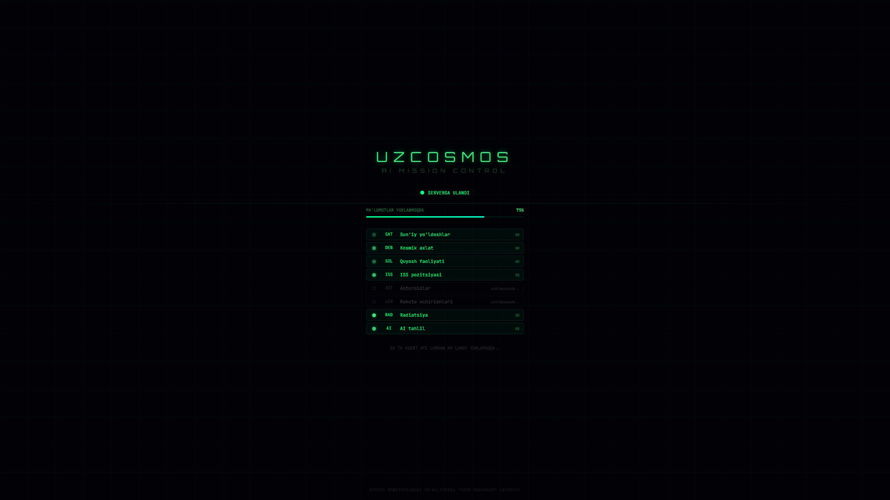

# UzCosmos AI — Space Monitoring Mission Control

<div align="center">

**Real-time space monitoring system with 10 autonomous AI agents, interactive 3D globe, and live data from NASA, CelesTrak, and space APIs.**

[](https://python.org)
[](https://fastapi.tiangolo.com)
[](https://react.dev)
[](https://threejs.org)
[](LICENSE)

</div>

---

## Screenshots

<div align="center">

<p><em>Loading Screen — 10 agents connecting to space APIs in real-time</em></p>
</div>

> **Note:** To see the full 3D globe and dashboard, run the project locally. Headless browser screenshots cannot capture WebGL content.

---

## Overview

UzCosmos AI is a comprehensive space situational awareness platform that monitors Earth's orbital environment in real-time. It features:

- **2,600+ real satellites** tracked via CelesTrak TLE/SATCAT data with full metadata (owner, launch date, cosmodrome, orbit parameters)
- **22,800 space debris objects** with collision probability assessment
- **10 autonomous agents** running concurrently, each monitoring a different aspect of the space environment
- **Interactive 3D globe** with NASA Blue Marble textures, day/night shader, atmospheric effects, and clickable satellites
- **Real-time WebSocket** data streaming from backend to frontend
- **10 dedicated dashboard pages** with charts, tables, and live telemetry

---

## Architecture

```
┌─────────────────────────────────────────────────────────────┐
│                    UzCosmos AI Backend                       │
│                                                             │
│  ┌────────────┐ ┌────────────┐ ┌────────────┐              │
│  │ Satellite   │ │ Debris     │ │ Solar      │              │
│  │ Tracker     │ │ Hunter     │ │ Weather    │   10 Async   │
│  │ (CelesTrak) │ │ (22.8K)    │ │ (NASA)     │   Agents     │
│  ├────────────┤ ├────────────┤ ├────────────┤              │
│  │ ISS Live    │ │ Asteroid   │ │ Launch     │              │
│  │ Tracker     │ │ Watch      │ │ Monitor    │              │
│  │ (OpenNotify)│ │ (NASA SBDB)│ │ (LL2 API)  │              │
│  ├────────────┤ ├────────────┤ ├────────────┤              │
│  │ Orbit       │ │ Radiation  │ │ AI Brain   │              │
│  │ Predictor   │ │ Shield     │ │ Commander  │              │
│  ├────────────┤ ├────────────┤ ├────────────┤              │
│  │ Alert System│ │            │ │            │              │
│  └─────┬──────┘ └─────┬──────┘ └─────┬──────┘              │
│        └──────────────┼──────────────┘                      │
│                  Event Bus (Pub/Sub)                         │
│                       │                                     │
│              WebSocket + REST API                           │
│                  (FastAPI)                                   │
└───────────────────────┼─────────────────────────────────────┘
                        │
┌───────────────────────┼─────────────────────────────────────┐
│                    Frontend                                  │
│                                                             │
│  ┌──────────┐  ┌───────────────────────────────────┐        │
│  │ Sidebar  │  │  3D Globe (Three.js / R3F)        │        │
│  │ Nav Menu │  │  • NASA Blue Marble textures       │        │
│  │          │  │  • Day/night shader                │        │
│  │ 10 Pages │  │  • 2600+ satellite sprites         │        │
│  │          │  │  • Clickable with full metadata     │        │
│  │          │  │  • Launch trajectories              │        │
│  │          │  │  • City markers (zoom-dependent)    │        │
│  └──────────┘  └───────────────────────────────────┘        │
│                                                             │
│  React 18 + Zustand + Framer Motion + Recharts              │
└─────────────────────────────────────────────────────────────┘
```

---

## 10 Agent System

| # | Agent | Data Source | What it does |
|---|---|---|---|
| 1 | **Satellite Tracker** | CelesTrak GP + SATCAT | Tracks 2,600+ satellites with SGP4 propagation, enriched with owner/launch/type metadata |
| 2 | **Debris Hunter** | Simulated (physics-based) | Models 22,800 debris objects across LEO/MEO/GEO with conjunction assessment |
| 3 | **Solar Weather** | NASA DONKI API | Monitors CMEs, solar flares, geomagnetic storms, Kp index |
| 4 | **ISS Tracker** | Open Notify API | Real-time ISS position, crew roster, Uzbekistan flyover predictions |
| 5 | **Asteroid Watch** | NASA SBDB / NeoWs API | Near-Earth object monitoring, threat scoring, impact energy calculation |
| 6 | **Launch Monitor** | Launch Library 2 API | Live rocket launches worldwide with trajectory simulation |
| 7 | **Orbit Predictor** | Computed | Orbital decay analysis, re-entry predictions for tracked objects |
| 8 | **Radiation Shield** | Simulated (physics) | Van Allen belt monitoring, South Atlantic Anomaly, crew dose rates |
| 9 | **AI Brain** | Cross-agent analysis | Aggregates all data, computes threat levels, generates reports |
| 10 | **Alert System** | All agents | Priority-based alert aggregation with severity classification |

---

## Dashboard Pages

| Page | Description |
|---|---|
| **Mission Control** | Interactive 3D globe with all space objects visualized |
| **Satellites** | Pie/bar charts by group, altitude distribution, searchable table |
| **Space Debris** | Risk breakdown, zone distribution, collision warnings |
| **Launches** | Live in-flight rockets with telemetry, upcoming countdowns, pad map |
| **ISS Tracker** | Real-time position, crew list, Uzbekistan flyover predictions |
| **Solar Weather** | Kp index gauge, solar wind parameters, CME/flare history |
| **Asteroids** | NEO table with threat scores, miss distances, impact energies |
| **Radiation** | Van Allen belts, SAA status, crew safety assessment |
| **AI Analysis** | Threat trend chart, breakdown by source, agent status monitor |
| **Alerts** | Chronological alert feed with severity badges |

---

## Tech Stack

| Layer | Technology |
|---|---|
| **Backend** | Python 3.10+, FastAPI, AsyncIO, aiohttp |
| **Real-time** | WebSocket (native FastAPI) |
| **Frontend** | React 18, Vite, TypeScript-ready |
| **3D Engine** | Three.js via @react-three/fiber + drei |
| **State** | Zustand |
| **Charts** | Recharts |
| **Animations** | Framer Motion |
| **Styling** | Tailwind CSS |

---

## API Sources (All Free)

| API | Data | Auth |
|---|---|---|
| [CelesTrak GP](https://celestrak.org) | Satellite TLE / orbital elements | No key needed |
| [CelesTrak SATCAT](https://celestrak.org/satcat/) | Satellite catalog (owner, launch, type) | No key needed |
| [NASA DONKI](https://api.nasa.gov) | CMEs, solar flares, geomagnetic storms | Free key (DEMO_KEY) |
| [NASA SBDB](https://ssd-api.jpl.nasa.gov) | Near-Earth asteroid close approaches | No key needed |
| [Open Notify](http://api.open-notify.org) | ISS position, astronaut list | No key needed |
| [Launch Library 2](https://thespacedevs.com/llapi) | Rocket launches worldwide | No key (300 req/day) |

---

## Getting Started

### Prerequisites

- Python 3.10+
- Node.js 18+

### Installation

```bash
# Clone the repository
git clone https://github.com/plux96/UzCosmosAI.git
cd UzCosmosAI

# Install backend dependencies
pip install -r requirements.txt

# Install frontend dependencies
cd frontend
npm install
cd ..
```

### Running

**Option 1: Start script**
```bash
# Windows
start.bat

# Linux/Mac
chmod +x start.sh && ./start.sh
```

**Option 2: Manual**
```bash
# Terminal 1 — Backend (starts 10 agents)
python main.py

# Terminal 2 — Frontend
cd frontend && npm run dev
```

### Access

| Service | URL |
|---|---|
| **Frontend** | http://localhost:5173 |
| **Backend API** | http://localhost:8000 |
| **API Docs** | http://localhost:8000/docs |
| **WebSocket** | ws://localhost:8000/ws |

---

## API Endpoints

```
GET /api/status       — System status and agent health
GET /api/satellites   — All tracked satellites with metadata
GET /api/debris       — Space debris field data
GET /api/solar        — Solar weather parameters
GET /api/iss          — ISS position and crew
GET /api/asteroids    — Near-Earth objects
GET /api/launches     — Rocket launches and in-flight data
GET /api/radiation    — Radiation environment
GET /api/threats      — AI threat assessment
GET /api/alerts       — Active alerts
GET /api/report       — AI-generated status report
```

---

## Project Structure

```
UzCosmosAI/
├── main.py                    # FastAPI server + agent orchestrator
├── config/
│   └── settings.py            # API keys, intervals, thresholds
├── backend/
│   ├── agents/
│   │   ├── base_agent.py      # Abstract agent with HTTP client
│   │   ├── satellite_tracker.py
│   │   ├── debris_hunter.py
│   │   ├── solar_weather.py
│   │   ├── iss_tracker.py
│   │   ├── asteroid_watch.py
│   │   ├── launch_monitor.py
│   │   ├── orbit_predictor.py
│   │   ├── radiation_shield.py
│   │   ├── ai_brain.py
│   │   └── alert_system.py
│   ├── core/
│   │   └── event_bus.py       # Pub/sub event system + WS broadcast
│   └── api/
│       └── routes.py          # REST endpoints
├── frontend/
│   ├── public/textures/       # NASA Earth textures
│   └── src/
│       ├── components/
│       │   ├── 3d/            # Three.js globe, satellites, launches
│       │   ├── pages/         # 10 dashboard pages
│       │   ├── dashboard/     # Shared dashboard widgets
│       │   └── panels/        # Info panels
│       ├── stores/            # Zustand global state
│       └── hooks/             # WebSocket connection
└── requirements.txt
```

---

## How It Works

1. **Backend starts** → 10 agents launch as async tasks
2. **Each agent** fetches data from its API at configured intervals (5–300 seconds)
3. **Events** are published to the central Event Bus
4. **WebSocket** broadcasts all events to connected frontend clients
5. **Frontend** receives events, updates Zustand store, re-renders UI
6. **AI Brain** agent cross-analyzes all data every 15 seconds, computes threat levels
7. **Alert System** aggregates high-priority events into a unified alert feed

---

## License

MIT

---

<div align="center">

**Built for "Yosh Muhandis" (Young Engineer) Competition**

*Space Robotics Direction — Republic of Uzbekistan, 2026*

</div>
